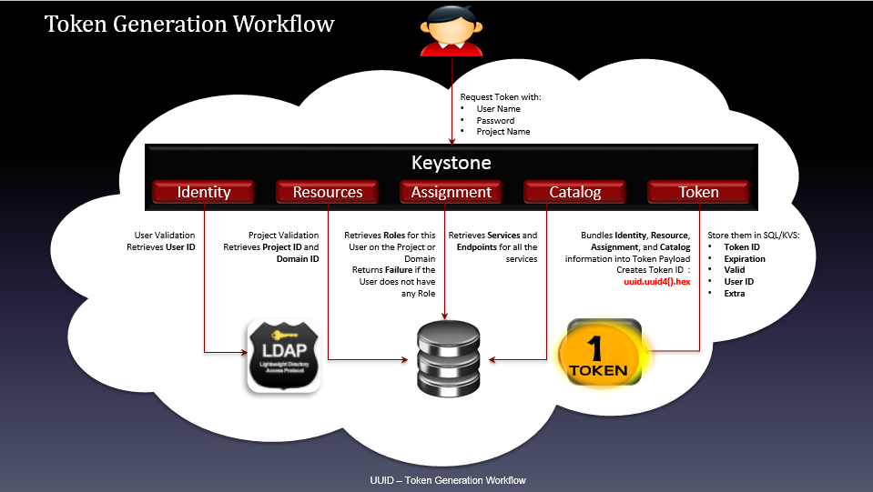
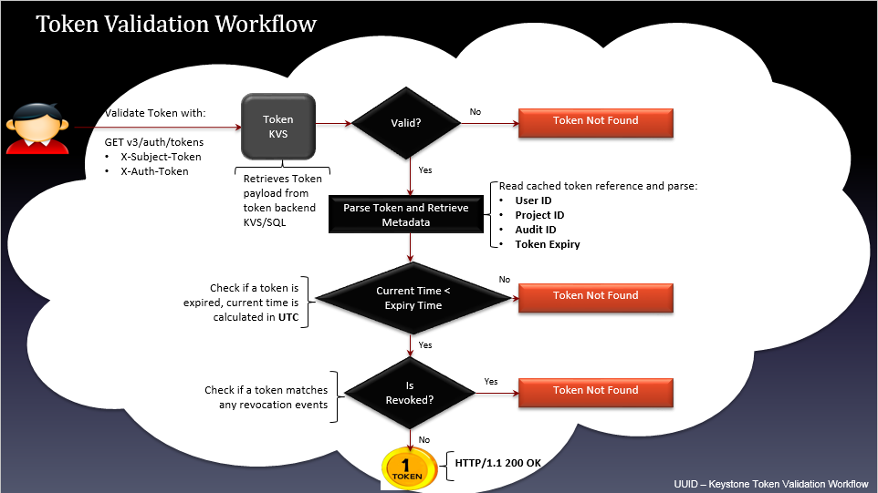

## Câu 1: Nhiệm vụ và chức năng chính của keystone 
3 chức năng chính của keystone
1.1 Identity

Nhận diện những người đang cố truy cập vào các tài nguyên cloud
Trong keystone, identity thường được hiểu là User
Tại những mô hình OpenStack nhỏ, identity của user thường được lưu trữ trong database của keystone. Đối với những mô hình lớn cho doanh nghiệp thì 1 external Identity Provider thường được sử dụng.
1.2 Authentication

Là quá trình xác thực những thông tin dùng để nhận định user (user's identity)

keystone có tính pluggable tức là nó có thể liên kết với những dịch vụ xác thực người dùng khác như LDAP hoặc Active Directory.

Thường thì keystone sử dụng Password cho việc xác thực người dùng. Đối với những phần còn lại, keystone sử dụng tokens.

OpenStack dựa rất nhiều vào tokens để xác thực và keystone chính là dịch vụ duy nhất có thể tạo ra tokens

Token có giới hạn về thời gian được phép sử dụng. Khi token hết hạn thì user sẽ được cấp một token mới. Cơ chế này làm giảm nguy cơ user bị đánh cắp token.

Hiện tại, keystone đang sử dụng cơ chế bearer token. Có nghĩa là bất cứ ai có token thì sẽ có khả năng truy cập vào tài nguyên của cloud. Vì vậy việc giữ bí mật token rất quan trọng.

1.3 Access Management (Authorization)

Access Management hay còn được gọi là Authorization là quá trình xác định những tài nguyên mà user được phép truy cập tới.

Trong OpenStack, keystone kết nối users với những Projects hoặc Domains bằng cách gán role cho user vào những project hoặc domain ấy.

Các projects trong OpenStack như Nova, Cinder...sẽ kiểm tra mối quan hệ giữa role và các user's project và xác định giá trị của những thông tin này theo cơ chế các quy định (policy engine). Policy engine sẽ tự động kiểm tra các thông tin (thường là role) và xác định xem user được phép thực hiện những gì.


## Câu 2: Keystone làm việc như thế nào vào các thành phần của keystone? 
Cung cấp giao diện xác thực và quản lí truy cập cho các services của OpenStack. Nó cũng đồng thời lo toàn bộ việc giao tiếp và làm việc với các hệ thống xác thực bên ngoài.

Cung cấp danh sách đăng kí các containers (“Projects”) mà nhờ vậy các services khác của OpenStack có thể dùng nó để "tách" tài nguyên (servers, images,...)

Cung cấp danh sách đăng kí các Domains được dùng để định nghĩa các khu vực riêng biệt cho users, groups, và projects khiến các khách hàng trở nên "tách biệt" với nhau.

Danh sách đăng kí các Roles được keystone dùng để ủy quyền cho các services của OpenStack thông qua file policy.

Assignment store cho phép users và groups được gán các roles trong projects và domains.

Catalog lưu trưc các services của OpenStack, endpoints và regions, cho phép người dùng tìm kiếm các endpoints của services mà họ cần.

Các thành phần của keystone: use, group user, project, domain, role, token, catalog.

##  Câu 3: Thế nào là Domain, Project, Group, User, Roles. Các khái niệm khác trong keystone.

### Domains
Trong thời kì đầu, không có bất cứ cơ chế nào để hạn chế sự xuất hiện của các project tới những nhóm user khác nhau. Điều này có thể gây ra những sự nhầm lẫn hay xung đột không đáng có giữa các tên của project của các tổ chức khác nhau.

Tên user cũng vậy và nó hoàn toàn cũng có thể dẫn tới sự nhầm lẫn nếu hai tổ chức có user có tên giống nhau.

Vì vậy mà khái niệm Domain ra đời, nó được dùng để cô lập danh sách các Projects và Users.

Domain được định nghĩa là một tập hợp các users, groups, và projects. Nó cho phép người dùng chia nguồn tài nguyên cho từng tổ chức sử dụng mà không phải lo xung đột hay nhầm lẫn.

### Projects
Trong Keystone, Project được dùng bởi các services của OpenStack để nhóm và cô lập các nguồn tài nguyên. Nó có thể được hiểu là 1 nhóm các tài nguyên mà chỉ có một số các user mới có thể truy cập và hoàn toàn tách biệt với các nhóm khác.

Ban đầu nó được gọi là tenants sau đó được đổi tên thành projects.

Mục đích cơ bản nhất của keystone chính là nơi để đăng kí cho các projects và xác định ai được phép truy cập projects.

Bản thân projects không sở hữu users hay groups mà users và groups được cấp quyền truy cập tới project sử dụng cơ chế gán role.

Trong một vài tài liệu của OpenStack thì việc gán role cho user còn được gọi là "grant".

### Users and User Groups (Actors)
Trong keystone, Users và User Groups là những đối tượng được cấp phép truy cập tới các nguồn tài nguyên được cô lập trong domains và projects.

Groups là một tập hợp các users. Users và User Groups được gọi là Actors.

Mối quan hệ giữa domains, projects, users, và groups:


### Roles
Roles được dùng để hiện thực hóa việc cấp phép trong keystone. Một actor có thể có nhiều roles đối với từng project khác nhau.

### Assignment
Role assignment là sự kết hợp của actor, target và role.
Role assignment được cấp phát, thu hồi, và có thể được kế thừa giữa các users, groups, project và domains.
### Targets
Projects và Domains đều giống nhau ở chỗ cả hai đều là nơi mà role được "gán" lên.

Vì thế chúng được gọi là targets.

### Catalog
Chứa URLs và endpoints của các services khác nhau.
Nếu không có Catalog, users và các ứng dụng sẽ không thể biết được nơi cần chuyển yêu cầu để tạo máy ảo hoặc lưu dữ liệu.
service này được chia nhỏ thành danh sách các endpoints và mỗi một endpoint sẽ chứa admin URL, internal URL, and public URL.

## Câu 4 token là gì và các loại token keystone hỗ trợ.
### Token
Để user truy cập bất cứ OpenStack API nào thì user cần chúng minh họ là ai và họ được phép gọi tới API. Để làm được điều này, họ cần có token và "dán" chúng vào "API call". Keystone chính là service chịu trách nhiệm tạo ra tokens.
Sau khi được xác thực thành công bởi keystone thì user sẽ nhận được token. Token cũng chứa các thông tin ủy quyền của user trên cloud.
Token có cả phần ID và payload. ID được dùng để đảm bảo rằng nó là duy nhất trên mỗi cloud và payload chứa thông tin của user.

### Có 3 loại token keystone hỗ trợ 

UUID Tokens
UUID là token format đầu tiên của keystone, nó đơn giản chỉ là một chuỗi UUID gồm 32 kí tự được generate random. Nó được xác thực bởi identity service. Phương thức hexdigest() được sử dụng để tạo ra chuỗi kí tự hexa. Điều này khiến token URL trở nên an toàn và dễ dàng trong việc vận chuyển đến các môi trường khác.

UUID token bược phải được lưu lại trong một backend (thường là database). Nó cũng có thể được loại bỏ bằng các sử dụng DELETE request với token id. Tuy nhiên nó sẽ không thực sự bị loại bỏ khỏi backend mà chỉ được đánh dấu là đã được loại bỏ. Vì nó chỉ có 32 bytes nên kích thước của nó trong HTTP header cũng sẽ là 32 bytes.

Loại token này rất nhỏ và dễ sử dụng quy nhiên nếu sử dụng nó, Keystone sẽ là "cổ chai" của hệ thống bởi mọi cuộc giao tiếp đều cần tới keystone để xác thực token.

Method dùng để sinh ra UUID token:
```
def _get_token_id(self, token_data):
 return uuid.uuid4().hex
```
Token Generation Workflow



User request tới keystone tạo token với các thông tin: user name, password, project name
Chứng thực user, lấy User ID từ backend LDAP (dịch vụ Identity)
Chứng thực project, thu thập thông tin Project ID và Domain ID từ Backend SQL (dịch vụ Resources)
Lấy ra Roles từ Backend trên Project hoặc Domain tương ứng trả về cho user, nếu user không có bất kỳ roles nào thì trả về Failure(dịch vụ Assignment)
Thu thập các Services và các Endpoints của các service đó (dịch vụ Catalog)
Tổng hợp các thông tin về Identity, Resources, Assignment, Catalog ở trên đưa vào Token payload, tạo ra token sử dụng hàm uuid.uuid4().hex
Lưu thông tin của Token vào SQL/KVS backend với các thông tin: TokenID, Expiration, Valid, UserID, Extra
Token Validation Workflow



Gửi yêu cầu chứng thực token sử dụng API: GET v3/auth/tokens và token (X-Subject-Token, X-Auth-Token)
Thu thập token payloads từ token backend KVS/SQL kiểm tra trường valid. Nếu không hợp lệ trả về thông báo Token Not Found. Nếu tìm thấy chuyển sang bước tiếp theo
Phân tích token và thu thập metadata: User ID, Project ID, Audit ID, Token Expire
Kiểm tra token đã expired chưa. Nếu thời điểm hiện tại < "expired time" theo UTC thì token chưa expired, chuyển sang bước tiếp theo, ngược lại trả về thông báo token not found
Kiểm tra xem token đã bị thu hồi chưa (kiểm tra trong bảng revocation_event của database keystone)
Nếu token đã bị thu hồi (tương ứng với 1 event trong bảng revocation_event) trả về thông báo Token Not Found. Nếu chưa bị thu hồi trả về token (truy vấn HTTP thành công HTTP/1.1 200 OK )

Token Revocation Workflow


Gửi yêu cầu thu hồi token với API request DELETE v3/auth/tokens. Trước khi thực hiện sự kiện thu hồi token thì phải chứng thực token nhờ vào tiến trình Token Validation Workflow đã trình bày ở trên.
Kiểm tra trường Audit ID. Nếu có, tạo sự kiện thu hồi với audit id. Nếu không có audit id, tạo sự kiện thu hồi với token expired
Nếu tạo sự kiện thu hồi token với audit ID, các thông tin cần cập nhật vào revocation_event table của keystone database gồm: audit_id, revoke_at, issued_before.
Nếu tạo sự kiện thu hồi token với token expired, các thông tin cần thiết cập nhật vào revocation_event table của keystone database gồm: user_id, project_id, revoke_at, issued_before, token_expired.
Loại bỏ các sự kiện của các token đã expired từ bảng revocation_event của database "keystone"
Cập nhật vào token database, thiết lập lại trường "valid" thành false (0)
Multiple Data Centers


UUID Token không hỗ trợ xác thực và ủy quyền trong trường hợp multiple data centers bởi token được lưu dưới dạng persistent (cố định và không thể thay đổi). Như ví dụ mô tả ở hình trên, một hệ thống cloud triển khai trên hai datacenter ở hai nơi khác nhau. Khi xác thực với keystone trên datacenter US-West và sử dụng token trả về để request tạo một máy ảo với Nova, yêu cầu hoàn toàn hợp lệ và khởi tạo máy ảo thành công. Trong khi nếu mang token đó sang datacenter US-East yêu cầu tạo máy ảo thì sẽ không được xác nhận do token trong backend database US-West không có bản sao bên US-East.

PKI Tokens
Token này chứa một lượng khá lớn thông tin ví dụ như: thời gian nó được tạo, thời gian nó hết hiệu lực, thông tin nhận diện người dùng, project, domain, thông tin về role cho user, danh mục dịch vụ,... Tất cả các thông tin này được lưu ở trog phần payload của file định dạng JSON. Phần payload được "signed" theo chuẩn X509 và đóng gói dưới dạng cryptographic message syntax (CMS). Với PKIz thì phần payload được nén sử dụng zlib.

Dưới đây là một ví dụ về JSON token payload:
```
{
    "token": {
      "domain": {
          "id": "default",
          "name": "Default"
        },
        "methods": [
        "password"
        ],
        "roles": [
            {
              "id": "c703057be878458588961ce9a0ce686b",
              "name": "admin"
            }
        ],
        "expires_at": "2014-06-10T21:52:58.852167Z",
        "catalog": [
            {
                "endpoints": [
                    {
                         "url": "http://localhost:35357/v2.0",
                         "region": "RegionOne",
                         "interface": "admin",
                         "id": "29beb2f1567642eb810b042b6719ea88"
                    },
                    {
                         "url": "http://localhost:5000/v2.0",
                         "region": "RegionOne",
                         "interface": "internal",
                         "id": "87057e3735d4415c97ae231b4841eb1c"
                    },
                    {
                         "url": "http://localhost:5000/v2.0",
                         "region": "RegionOne",
                         "interface": "public",
                         "id": "ef303187fc8d41668f25199c298396a5"
                    }
                ],
                "type": "identity",
                "id": "bd7397d2c0e14fb69bae8ff76e112a90",
                "name": "keystone"
              }
        ],
        "extras": {},
        "user": {
            "domain": {
                "id": "default",
                "name": "Default"
              },
                "id": "3ec3164f750146be97f21559ee4d9c51",
                "name": "admin"
              },
              "audit_ids": [
                  "Xpa6Uyn-T9S6mTREudUH3w"
              ],
              "issued_at": "2014-06-10T20:52:58.852194Z"
           }
        }
```
Muốn gửi token qua HTTP, JSON token payload phải được mã hóa base64 với 1 số chỉnh sửa nhỏ. Cụ thể, Format=CMS+[zlib] + base64. Ban đầu JSON payload phải được ký sử dụng một khóa bất đối xứng(private key), sau đó được đóng gói trong CMS (cryptographic message syntax - cú pháp thông điệp mật mã). Với PKIz format, sau khi đóng dấu, payload được nén lại sử dụng trình nén zlib. Tiếp đó PKI token được mã hóa base64 và tạo ra một URL an toàn để gửi token đi.. Dưới đây là ví dụ của token được dùng để vận chuyển:

MIIDsAYCCAokGCSqGSIb3DQEHAaCCAnoEggJ2ew0KICAgICJhY2QogICAgICAgI...EBMFwwVzELMAkGA
1UEBhMCVVMxDjAMBgNVBAgTBVVuc2V0MCoIIDoTCCA50CAQExCTAHBgUrDgMQ4wDAYDVQQHEwVVbnNldD
EOMAwGA1UEChM7r0iosFscpnfCuc8jGMobyfApz/dZqJnsk4lt1ahlNTpXQeVFxNK/ydKL+tzEjg
Kích cỡ của token nếu có 1 endpoints trong danh mục dịch vụ đã rơi vào khoảng 1700 bytes. Với những hệ thống lớn, kích cỡ của nó sẽ vượt mức cho phép của HTTP header (8KB). Ngay cả khi được nén lại trong PKIz format thì vấn đề cũng không được giải quyết khi mà nó chỉ làm kích thước token nhỏ đi khoảng 10%.

Mặc dù PKI và PKIz token có thể được cache, nó vẫn có một vài khuyết điểm. Sẽ là khá khó để cấu hình keystone sử dụng loại token này. Thêm vào đó, kích thước lớn của nó cũng ảnh hưởng đến các service khác và rất khó khi sử dụng với cURL. Ngoài ra, keystone cũng phải lưu những token này trong backend vì thế người dùng vẫn sẽ phải flushing the Keystone token database thường xuyên.

Dưới đây là method để sinh ra PKI token:

def _get_token_id(self, token_data):
    try:
         token_json = jsonutils.dumps(token_data, cls=utils.PKIEncoder)
         token_id = str(cms.cms_sign_token(token_json,
                                           CONF.signing.certfile,
                                           CONF.signing.keyfile))
         return token_id
     except environment.subprocess.CalledProcessError:
         LOG.exception(_LE('Unable to sign token'))
         raise exception.UnexpectedError(_('Unable to sign token.'))
Để config PKI token, chúng ta cần sử dụng 3 loại certificates:

Signing Key tạo ra private key dưới định dạng PEM
Signing Certificates
Sử dụng Signing Key để tạo ra CSR (Certificate Signing Request)
Submit CSR tới CA (Certificate Authority)
Nhận lại chứng chỉ xác thực (cetificate) từ CA (certificate authority)
Certificate Authority Certificate
Token Generation Workflow


Người dùng gửi yêu cầu tạo token với các thông tin: User Name, Password, Project Name
Keystone sẽ chứng thực các thông tin về Identity, Resource và Asssignment (định danh, tài nguyên, assignment)
Tạo token payload định dạng JSON
Sign JSON payload với Signing Key và Signing Certificate , sau đó được đóng gói lại dưới định dang CMS (cryptographic message syntax - cú pháp thông điệp mật mã)
Bước tiếp theo, nếu muốn đóng gói token định dạng PKI thì convert payload sang UTF-8, convert token sang một URL định dạng an toàn. Nếu muốn token đóng gói dưới định dang PKIz, thì phải nén token sử dụng zlib, tiến hành mã hóa base64 token tạo ra URL an toàn, convert sang UTF-8 và chèn thêm tiếp đầu ngữ "PKIZ"
Lưu thông tin token vào Backend (SQL/KVS)
Token Validation Workflow


Vì id được generate bằng hàm hash của token nên quá trình validate token sẽ bắt đầu bằng việc sử dụng hàm hash để "băm" PKI toekn. Các bước sau đó (validate trong backend...) hoàn toàn giống với uuid.

Token Revocation Workflow

Hoàn toàn tương tự như tiến trình thu hồi UUID token

Multiple Data Centers


PKI và PKIz không thực sự support mutiple data centers. Các backend database ở hai datacenter phải có quá trình đồng bộ hoặc tạo bản sao các PKI/PKIz token thì mới thực hiện xác thực và ủy quyền được.